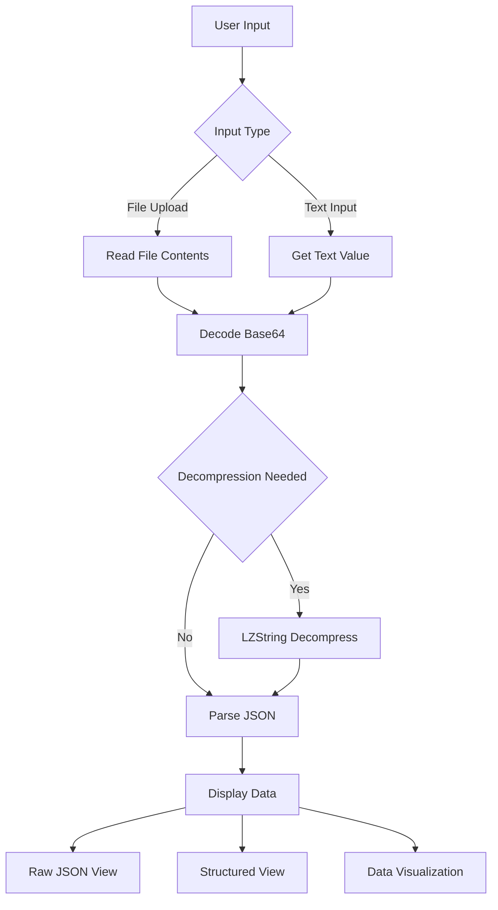

# Save File Dashboard Application Plan

## Overview
Create a modern web application that parses game save files using the provided decoding algorithm and displays the data in an interactive dashboard.

## Current Decoder Analysis
- **File**: `save-dashboard/save-decoder.js`
- **Functionality**:
  - Decodes compressed base64 save files (with LZString decompression)
  - Falls back to plain base64 decoding if LZString fails
  - Encodes decoded JSON back to compressed or plain base64
  - Uses DOM manipulation for input/output

## Tech Stack
- **Frontend Framework**: React 18
- **Language**: TypeScript
- **Build Tool**: Vite
- **Styling**: Tailwind CSS
- **Data Visualization**: Recharts
- **Compression**: LZString (from existing implementation)
- **State Management**: React Context API
- **File Handling**: Browser File API
- **Storage**: LocalStorage for user preferences

## Application Features
1. **File Upload**: Allow users to upload save files
2. **Text Input**: Support for direct text input of encoded save data
3. **Decoding**: Automatic decompression and parsing
4. **Data Display**: 
   - Raw JSON view with syntax highlighting
   - Structured views for different data types
   - Data visualization (charts, graphs) for numeric data
5. **Search & Filter**: Search functionality for decoded data
6. **Export**: Export decoded data in various formats (JSON, CSV)
7. **History**: Keep track of recently processed save files
8. **Settings**: Allow users to configure decoding options

## Project Structure
```
save-dashboard/
├── src/
│   ├── components/
│   │   ├── FileUpload.tsx
│   │   ├── DataDisplay.tsx
│   │   ├── RawJsonView.tsx
│   │   ├── Visualization.tsx
│   │   └── SearchBar.tsx
│   ├── utils/
│   │   ├── decoder.ts (converted TypeScript version)
│   │   └── helpers.ts
│   ├── hooks/
│   │   └── useSaveFile.ts
│   ├── contexts/
│   │   └── SaveFileContext.tsx
│   ├── types/
│   │   └── index.ts
│   ├── App.tsx
│   ├── main.tsx
│   └── index.css
├── public/
├── index.html
├── package.json
├── tsconfig.json
├── vite.config.ts
└── tailwind.config.js
```

## Implementation Steps
1. Set up Vite + React + TypeScript project
2. Install and configure dependencies (Tailwind CSS, Recharts)
3. Convert existing decoder.js to TypeScript (decoder.ts)
4. Create context for managing save file state
5. Implement file upload and text input components
6. Build decoding and parsing functionality
7. Create raw JSON view with syntax highlighting
8. Implement data visualization components
9. Add search and filter functionality
10. Create export and history features
11. Implement settings panel
12. Style the application with Tailwind CSS
13. Test the application with sample save files
14. Build for production

## Target Platform
- **Primary**: Web browser (Chrome, Firefox, Safari, Edge)
- **Responsive**: Mobile and desktop support
- **Offline**: Basic functionality without internet connection

## Data Processing Flow


## Success Criteria
- Application successfully decodes and displays sample save files
- All decoding scenarios are handled (compressed, uncompressed)
- Data is presented in a user-friendly manner
- Application is responsive and performs well
- Error handling and validation are implemented
- Users can easily navigate and interact with the dashboard